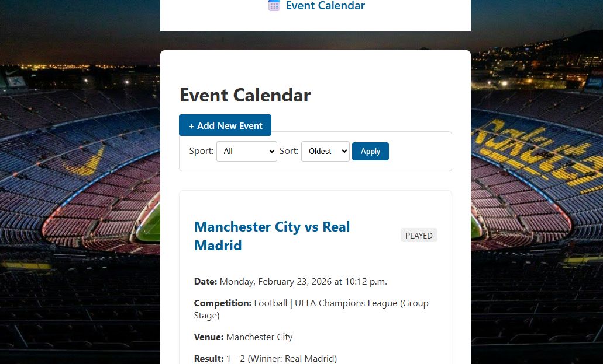
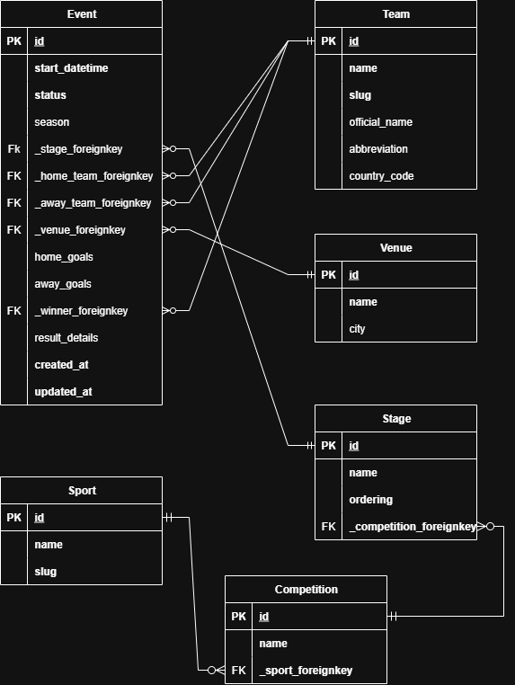

# Sportradar BE Coding Exercise: Event Calendar

This project is a complete backend solution for a sports event calendar, built as part of the Sportradar Coding Academy exercise.
## 🚀 Key Features

* **Event Management:** Full CRUD functionality (Create, Retrieve, Update) for sports events.
* **Dynamic Data Model:** Includes related models for `Sport`, `Team`, `Venue`, `Competition`, and `Stage`.
* **Efficient Queries:** Uses `select_related` in all list/detail views to prevent N+1 query problems.
* **Advanced Form Workflow:** Users can create related models (like `Team` or `Stage`) "on-the-fly" from the "Create Event" page using a `?next=` URL redirect.
* **Filtering & Sorting:** The main event list can be filtered by sport and sorted by date (newest or oldest first).
* **Clean Architecture:** Built using Django's Class-Based Views (ListView, DetailView, CreateView, UpdateView) and ModelForms.

## 📸 Screenshots

### Event List (Main Page)


### Database ER Diagram


---

## 💻 Technology Stack

* **Python 3.11+**
* **Django 5**
* **Database:** SQLite3 (for development)
* **Frontend:** Standard Django Templates (HTML/CSS)

---

## ⚙️ Setup and Installation

Follow these steps to get the project running on your local machine.

```shell
git clone https://github.com/olegicks/sports-calendar.git
cd sports-calendar

# For Windows
python -m venv venv
venv\Scripts\activate
# For macOS/Linux
python3 -m venv venv
source venv/bin/activate

pip install -r requirements.txt
python manage.py migrate
python manage.py loaddata initial_data.json
python manage.py runserver
```
### 🤖 AI Reflection
As per the assignment guidelines, an AI_Reflection.txt file is included in this repository detailing the use of AI as a support tool during development.