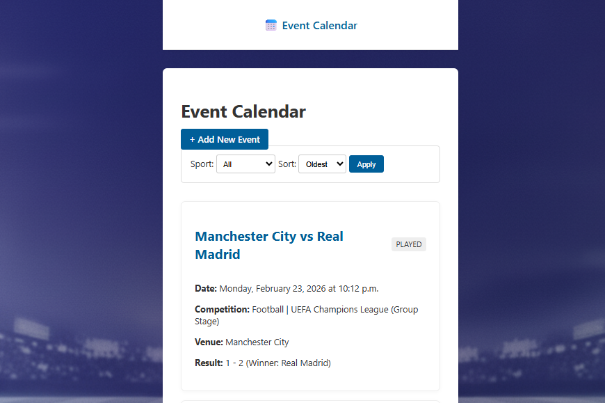

# Event Calendar Backend

This project is a backend implementation of a sports event calendar application built with Django.

## 🚀 Key Features

* **Event Management:** CRUD functionality (Create, Retrieve, Update) for events.
* **Relational Data Model:** Includes related entities such as `Sport`, `Team`, `Venue`, `Competition`, and `Stage`.
* **Efficient Queries:** Uses `select_related` to avoid N+1 query problems.
* **Flexible Form Workflow:** Related objects (e.g., `Team`, `Stage`) can be created during event creation using redirect flows.
* **Filtering & Sorting:** Events can be filtered by sport and sorted by date.
* **Clean Architecture:** Implemented with Django Class-Based Views and ModelForms.

## 📸 Screenshots

### Event List (Main Page)


### Database ER Diagram


---

## 💻 Technology Stack

* **Python 3.11+**
* **Django 5**
* **Database:** SQLite3
* **Frontend:** Django Templates (HTML/CSS)

---

## ⚙️ Setup and Installation

```shell
git clone https://github.com/olegicks/sports-calendar.git
cd sports-calendar

# Windows
python -m venv venv
venv\Scripts\activate

# macOS/Linux
python3 -m venv venv
source venv/bin/activate

pip install -r requirements.txt
python manage.py migrate
python manage.py loaddata initial_data.json
python manage.py runserver
